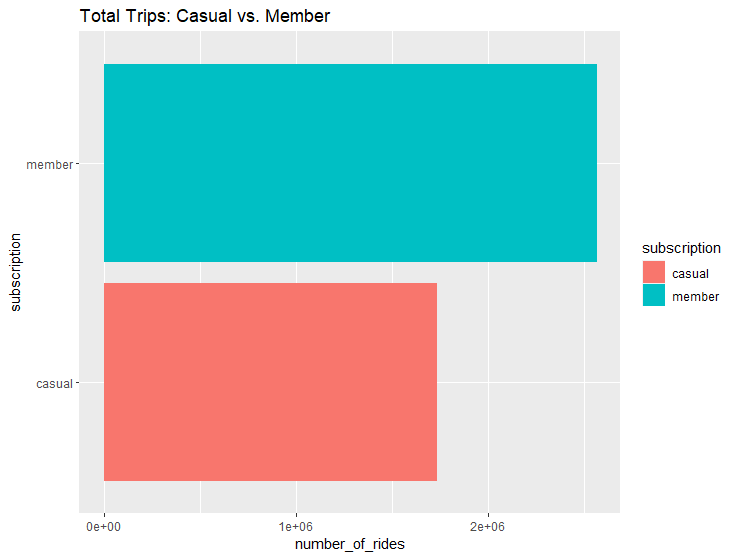
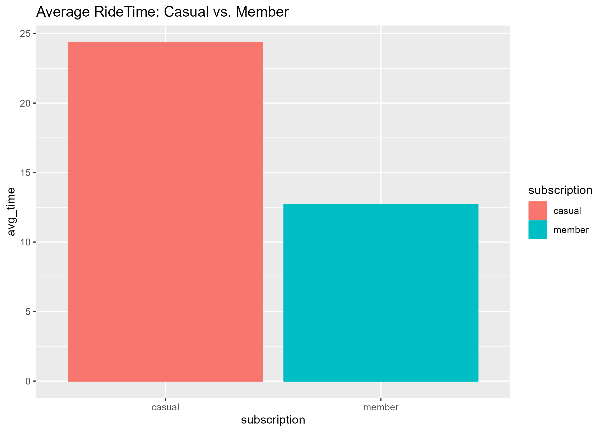
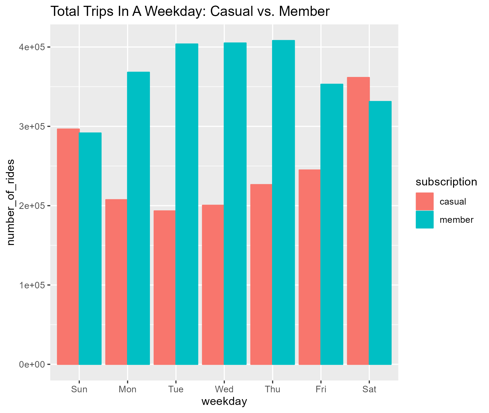
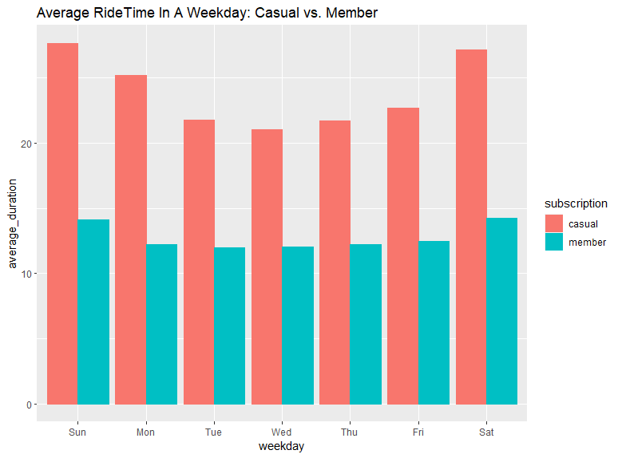
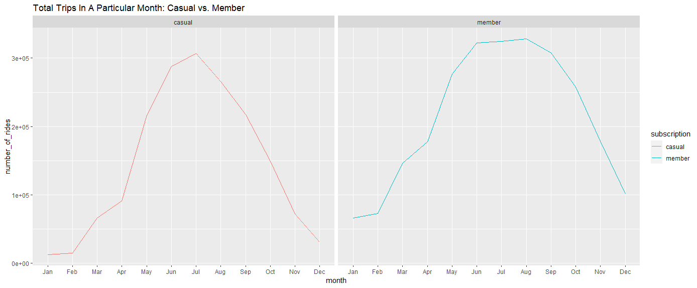
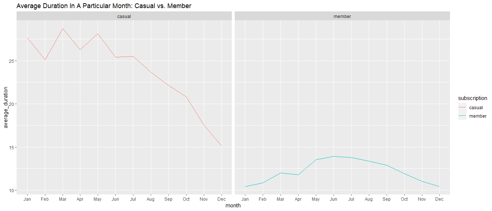
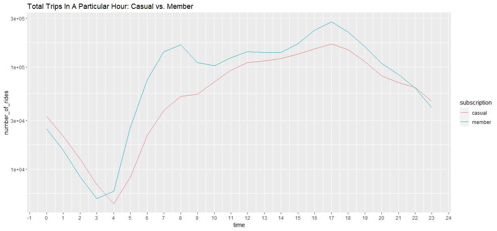

# INTRODUCTION
This is an optional case study from the Google Data Analytics Course that I recently completed. In this study, I put into practice the Data study Process that I learnt while taking the course by executing real-world responsibilities as a junior data analyst for a fictitious company called Cyclistic.

## BACKGROUND SCENARIO
In this mock data analysis, I'm assuming the role as a junior data analyst working in the marketing analyst team at Cyclistic, a bike-share company in Chicago. This company was founded in 2016 with the goal of providing people with alternative modes of transportation using bikes (both classic and electric). Cyclistic has grown their bike-share company to 5,824 geotracked bicycles and 692 stations in Chicago since then. The bikes can be unlocked in one station and locked in another, making it easy to move. This service is currently used by two sorts of members. Casual members (purchase a single or day pass) and annual members (purchase an annual membership). The director of marketing believes the company’s future success depends on maximizing the number of annual memberships. Therefore, my team wants to understand how casual riders and annual members use Cyclistic bikes differently. From these insights, my team will design a new marketing strategy to convert casual riders into annual members. But first, Cyclistic executives must approve my recommendations, so they must be backed up with compelling data insights and professional data visualizations.

## BUSINESS QUESTION
Annual members are more profitable than casual members, according to Cyclistic's financial analysts. The company wants to grasp the distinction between the two sorts of members in order to convert casual users into yearly members. My job is to collect and analyze data to answer the question, "What is the difference between casual riders and annual riders?" Lily Moreno (Director of Marketing), Cyclistic's marketing analytics team, and Cyclistic's executive team are all stakeholders.

## DATA PREPARATION AND CLEANING
To solve the business question, I will analyze the data from Cyclistic's database. The dataset contains data from January 2022 to December 2022 and I downloaded Cyclistic’s historical trip data from [here](https://divvy-tripdata.s3.amazonaws.com/index.html). Motivate International Inc. has made the data available under this [license](https://divvybikes.com/data-license-agreement). It is also cited, objective, innovative, up to date, and comprehensive. However, its data privacy policies prevent me from using personally identifiable information on riders.

### Data Transfer And Preparation
RSTUDIO was utilized to import the Excel Workbook files of each month in 2022. The dataset was merged into one dataset labeled all_year_trips. Once the dataset was merged, there were 5,317,314 rows with 7 columns (start_station id, end_station_id, start_lat, star_lng, end_lat, and end_lng were removed since they were not necessary to answering the business question). The columns consisted of ride_id, rideable_type, started_at, ended_at, start_station_name, end_station_name, and member_casual. Prior to the importation of the datasets into RStudio, Excel was utilized to calculate the weekday on which the rides took place which was stored in form of numbers (1-7) in the day_of_week column and also the ride length which was stored in the ride_length column. 

### Data Cleaning and Transformation
Here is a summary of my cleaning process. You can check out the full code on one of my [GitHub](https://github.com/EmmanuelOrunta/Google-Capstone/blob/main/Capstone%20Script.R) repositories. 

- Columns that were not required for my analysis were removed (start_station_id, end_station_id, start_lat, start_lng, end_lat, and end_lng).
- There were no duplicates when I checked. Each ride_id was distinct.
- The member_casual column was renamed to Subscription.
- Empty rows in the start_station_name and end_station_name were removed because they were needed or useful for our analysis.
- Renaming text strings in day of week column to actual day of the week i.e from 1 to Sunday, 2 to Monday and so on.
- Calculating ride_length in mins and secs from the started_at and ended_at column.
- After Calculating the ride length in secs and mins, ride lengths with negative values were removed as they were not needed for the analysis.
- Trips that lasted less than a minute were eliminated since they indicated that the bike had been stolen or was being serviced.

## ANALYSIS AND VISUALIZATION
The analysis was carried out in RStudio and the data visualizations was also created using RStudio. A bulk of my analysis was subjected to the Number of rides and average ride time comparison between casual and member rides. The following are the steps I carried out during my analysis:

- I performed summary statistics with the business question in mind for this phase, focusing on the distinction between members and casual riders.
- I calculated the total number of rides as well as the total number of stations in Cyclistic.
- An analysis was carried out for the Total rides and average ridetime per subscription.

        

Member riders had 2561008 rides, while casual riders had 1730953 rides. Though member rides took more rides in the year, the casual members had more ridetime on average, with casual rides averaging almost 25 mins while the members had almost 13 mins on average. This could be due to the fact that maybe members just ride to work, while casual riders usually ride for leisure.

- Analysis on total rides and average ride length per weekday for each type of subscription

        

Members usually account for most rides in a weekday but casual rides take more rides on weekends and average more ridetime in each weekday. 

- Analysis on total rides and average ride length per month for each type of subscription

        

Member and annual riders have a similar trajectory in terms of total rides made across the year with the peak periods coming around july for annual riders and member riders have their peak periods around June - August. Overall, more people ride in the warmer months of June, July, and August than in the colder months of January, February, and December. Both member types appear to favor biking during more stable weather conditions, as opposed to the Chicago winter months.

- Analysis on total rides and average ride length for a particular hour in a day for each type of subscription

       

Here, we can see that there are more annual members than casual ones. However, casual members ride later in the day while annual members have a spike in the morning (7/8 am) and then again in the evening (5/6 pm). This could be due to annual members going to work, while casual members could be tourists. 

-  I also discovered that the most frequently frequented station by casual passengers is Streeter Dr & Grand Ave, whereas the most frequently visited station for yearly members is Kingsbury St & Kinzie St.

## Insights/Summary
Differences between Casual and Annual Riders

- Casual riders have a larger gap under harsher weather conditions, but annual riders are more constant throughout the year regardless of weather (there is a dip in January, February, and December).
- Annual members often ride in the morning and early evening, whereas casual members ride later in the day.
- Although there are more annual riders, casual members prefer to ride for longer (in minutes). The average ride time for casual cyclists was 26 minutes, which was more than double the time for yearly riders (13 minutes).
- Weekdays see a higher percentage of yearly riders, while weekends see a higher percentage of casual riders.
- Conclusion: Casual riders primarily utilize Cyclistic for recreation, and many are visitors (cycling along the beach, near restaurants, and retail districts). The bikes are used for work by yearly riders. They frequently ride through financial and business sectors, as well as near a university and apartments.

## Recommendations
With all of the facts and findings presented above, there are a few suggestions that may encourage casual members to use Cyclistic's bike-share program. However, because casual members are mostly tourists, converting them to yearly members will be tough. That being stated, here are my three suggestions for resolving this problem:
